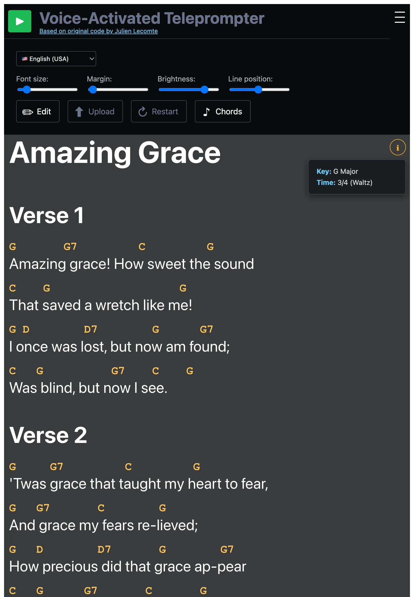

# Voice-Activated Teleprompter

*Based on [original code by Julien Lecomte](https://github.com/jlecomte/voice-activated-teleprompter)*

Julien's intro:

> This web-based single-page application (SPA) is a voice-activated teleprompter, i.e., it automatically scrolls the text you are reading as you are reading it. It is built using [Vite](https://vitejs.dev/), [React](https://react.dev/), [Redux](https://redux.js.org/), and [TypeScript](https://www.typescriptlang.org/). I routinely use it with my [Elgato Prompter](https://www.elgato.com/us/en/p/prompter) to create [my own YouTube videos](https://www.youtube.com/@darkskygeek). Such software already exists, but it is either rather expensive, or not robust enough. For example, the free online software created by Teleprompter Mirror [[link](https://telepromptermirror.com/telepromptersoftware.htm)] easily gets confused if you go off script or mispronounce too many words, and as a result, it will stop auto-scrolling. This is why I built this app.

**Note:** It supports English, French, German, Italian, Brazilian Portuguese, Spanish, and Swedish speech recognition. The app automatically detects your browser language and defaults accordingly, but you can manually select your preferred language using the dropdown in the toolbar. It was tested only in the Chrome web browser and may not work in other web browsers!

**Instructions:** Once you've opened the live demo, click on the `Edit` button in the toolbar. Paste your script into the content area and click on the `Edit` button again to validate. Then, click on the `Play` button in the toolbar and start reading your script. If you need to take a break, you can click on the `Stop` button at any time, and then later resume the transcription by clicking on the `Play` button again. You can also click on individual words in your script to reset the transcription to a specific index in case you need to re-read a section of your script.

## The added features



Changes made to the original version of [Voice-Activated Teleprompter](https://github.com/jlecomte/voice-activated-teleprompter):

- A more mobile friendly layout
- TypeScript rewrite
- Markdown support for teleprompter content
- [ChordPro](https://www.chordpro.org/chordpro/chordpro-chords/) notation support (e.g., `[G]`, `[C]`) positioned above lyrics
- Unidirectional scrolling (prevents jumping back on recognition errors)
- Keyboard shortcut for play/pause (P key)
- File upload support for importing scripts
- Swedish language support
- PostCSS with PurgeCSS for optimized builds
- Dev mode: expose Redux store on `window.__store__` for silent testing via browser console

You can also try the original app live [here](https://jlecomte.github.io/voice-activated-teleprompter/dist/).

## Silent Testing

In development mode, the Redux store is exposed on `window.__store__` so you can test scrolling and highlighting without speaking.

1. Run `npm run dev`
2. Paste your content and press P to start the teleprompter
3. Open browser DevTools console

Jump to a specific word:

```js
window.__store__.dispatch({ type: 'content/setFinalTranscriptIndex', payload: 15 })
```

Auto-advance through the entire script (every 500ms):

```js
let i = 0; const iv = setInterval(() => {
  const { textElements } = window.__store__.getState().content
  const tokens = textElements.filter(t => t.type === 'TOKEN')
  if (i >= tokens.length) { clearInterval(iv); return }
  window.__store__.dispatch({ type: 'content/setFinalTranscriptIndex', payload: tokens[i].index })
  i++
}, 500)
```

Stop the auto-advance:

```js
clearInterval(iv)
```

`window.__store__` is only available in development mode and will not be present in production builds.
